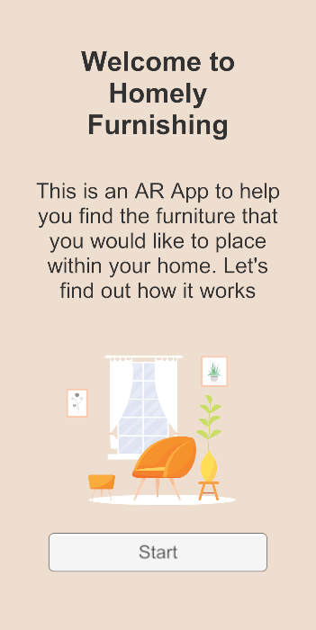
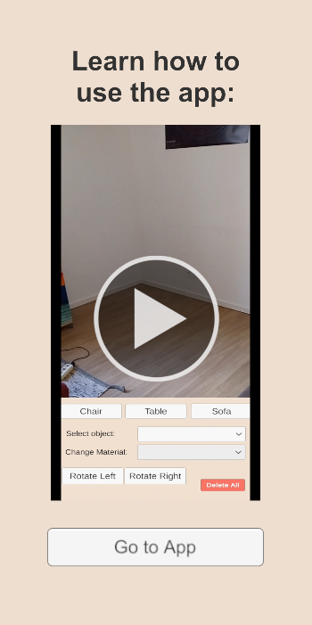
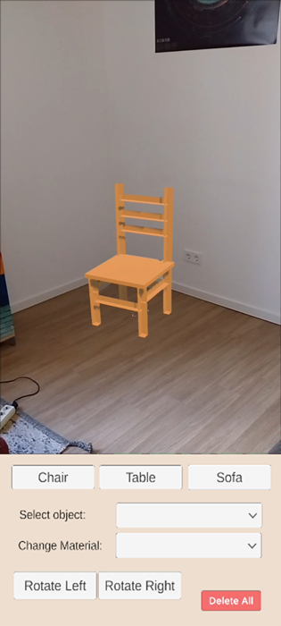

# Homely-Furnishing-AR-Vuforia
 
This is a project work within the course "special applications of computer science" of the HTW berlin.

Technologies used:
- Unity 3D 2021.3.20f1
- Vuforia 10.13.3  
- Rider 2022.3.2
- Davinci Resolve 18
